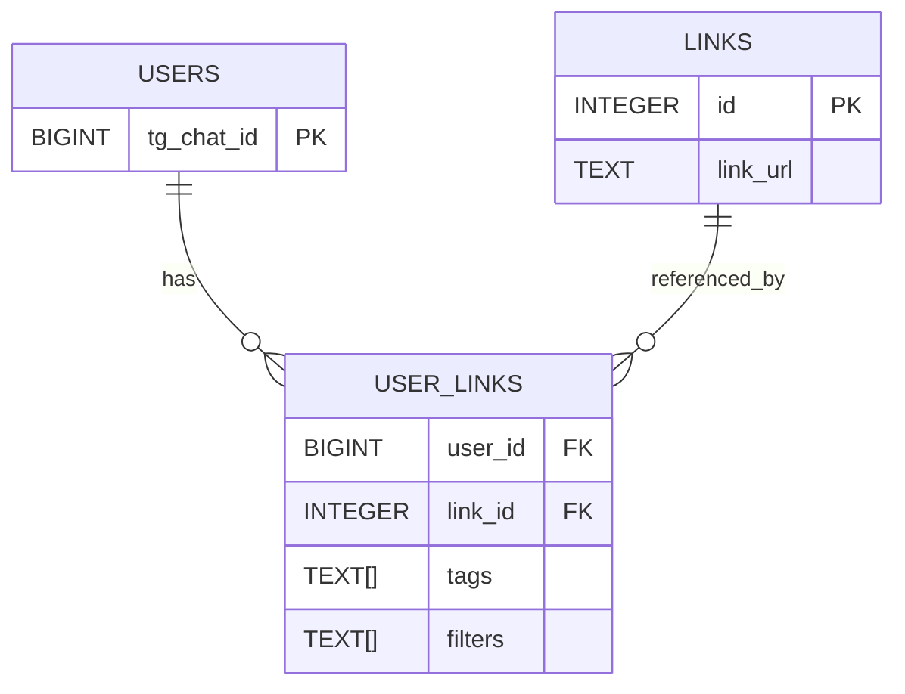

# LinkTracker

**Приложение для отслеживания обновлений контента**  
Единый бот-интерфейс для подписки на обновления GitHub и StackOverflow.

---

## О проекте
> Отправив боту ссылку на GitHub Issues/PR или вопрос на StackOverflow вы получаете единый агрегатор
уведомлений с возможностью фильтрации по авторам, тегам. Бот сам проверяет обновления и шлёт уведомления удобным способом: мгновенно или в виде дайджеста.

---

## Функционал

1. **Регистрация**  
    `/start` – регистрирует ваш чат в системе

2. **Отслеживание ссылки**  
   `/track` – диалог: ввод ссылки → ввод тэгов (опционально) → ввод фильтров (опционально) → подтверждение

3. **Отмена отслеживания**  
   `/untrack` – выбираете номер ссылки → подтверждение → удаление

4. **Список подписок**  
   `/list` – показывает ваши ссылки (кэшируется в Redis, инвалидируется при изменении)
 
5. **Выбор периодичности нотификации**

   `/notifications` - выбор между мгновенной нотификацией и дайджестом раз в сутки

6. **Обновления по тегам**

    `/upds_by_tags` - показывает обновления по интересующим тегам
---


## Технологии и компоненты

| Компонент         | Технологии / Библиотеки                | Задача                                                   |
|-------------------|----------------------------------------|----------------------------------------------------------|
| **Telegram-бот**  | Telethon                               | Обработка команд, FSM                                     |
| **API**           | FastAPI + httpx                        | Межсервисное общение                                      |
| **Планировщик**   | aiocron                                | Запуск проверок по расписанию                             |
| **DB (ORM)**      | SQLAlchemy                             | Хранение пользователей, ссылок, метаданных               |
| **DB (SQL)**      | asyncpg + row SQL                      | Альтернативная реализация доступа                         |
| **Миграции**      | Liquibase                              | Управление схемой PostgreSQL                              |
| **Kafka**         | aiokafka                               | Асинхронная передача уведомлений + DLQ                    |
| **Redis**         | redis                                  | Кэширование `/list` и состояние FSM                       |
| **Логирование**   | logging + JSONFormatter                | Структурные логи в файл и в консоль                       |
| **Тестирование**  | pytest, pytest-asyncio, testcontainers | Юнит- и интеграционные тесты с реальными контейнерами     |

---

## Архитектура приложения

```text
                                +-----------------+
+-------------------+           |                 |
|                   |      /-----    Postgres     |
|    Scrapper       |------     |                 |
|                   |--         +-----------------+
+-------------------+  \---
               |           \--- +-----------------+
               |               \-                 |
               | HTTP           |     Kafka       |
               |               /-                 |
               |           /--- +-----------------+
+-------------------+  /---
|                   |--
|       Bot         |           +-----------------+
|                   |------------                 |
+-------------------+           |  Telegram API   |
                                |                 |
                                +-----------------+
```

## Схема таблиц базы данных



## Подробное описание функциональности
- Scrapper (планировщик) при отправке сообщения с изменениями включает детализацию данных:
  - Для StackOverflow новый ответ или комментарий, сообщение включает:
       - текст темы вопроса 
       - имя пользователя 
       - время создания 
       - превью ответа или комментария (первые 200 символов)
  - Для GitHub новый PR или Issue, сообщение включает:
    - название PR или Issue
    - имя пользователя
    - время создания
    - превью описания (первые 200 символов)
- Логика планировщика (проверка ссылок) и отправки (уведомления) разнесены по разным сервисам
- Cервисы bot и scrapper общаются синхронно по http-протоколу или через Kafka, что позволяет не терять сообщения и отправить уведомления после починки сервиса, если он упал
- Особенности работы с БД:
  - При проверке обновлений не все ссылки загружаются в память сразу, а обрабатываются батчами
  - Для хранения данных используйте Postgres
  - Для миграций используется Liquibase, миграции написаны на языке SQL
  - Реализовано 2 способа работы с БД: "голый" SQL и ORM